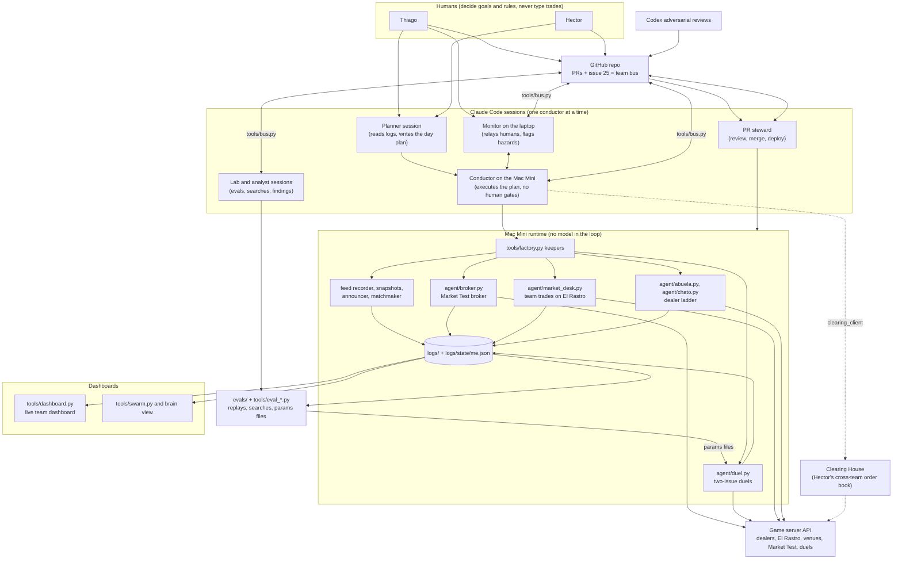

# negotiation-agent

Trading bots for The Bazaar · Cromos de Madrid, the trading-card negotiation game of the Claude Community 48H Hackathon Madrid (2 to 4 October 2026). Through the game's HTTP API they haggle with the card dealers, trade cards with other teams, play one-to-one duels and run a market venue. Built by Hector Moyano and Thiago Amaro.

**Result.** 4th of 18 teams when the market froze on Sunday at 15:00, with a score of 34.19. The two scored columns tell different stories:

- Negotiating: 26.04 of 30, first of the 18 teams on that column.
- Market-making: 8.15 of 30, 17th of 18. Our venue hosted no trades between other teams, and this column was the gap to the top three.

**Why it is interesting**

- No model call in the live trading loop. Each part of the game has its own small deterministic Python bot: code decides every number, and every buy or sell is checked against the team's private value before it is sent. The bots do not call a model, so they do not depend on the Claude account's usage limits.
- Almost all of the code, including the lines the bots send, was written ahead of time by Claude Code sessions steered by the team.
- Claude worked one level above the loop: a planner session read the logs and wrote the day plan, one conductor session at a time ran it, lab and analyst sessions ran the evals, and a steward session merged the pull requests and ran reviews on selected ones.
- Offline evals, with acceptance rules fixed before each run, shipped one change (the Duels III parameters) and stopped two others.

The full write-up is [`SUBMISSION.md`](SUBMISSION.md). A short note written the day after, with the final pull-request count and two corrections to that file, is [`docs/after-the-event.md`](docs/after-the-event.md).

## Architecture



## Where to look

- [`SUBMISSION.md`](SUBMISSION.md): the full write-up, with the decisions, the results, the honest limitations and every pull request.
- [`evals/`](evals/): the offline evals, one folder per flow, with cases, metrics and verdicts.
- [`agent/duel.py`](agent/duel.py): the duel negotiator. Silent by default, at most two messages per duel, tuned through a params file.
- [`docs/submission/orchestration/`](docs/submission/orchestration/): how the Claude sessions were briefed and run: the Sunday plan, the conductor's log and the session hand-off briefings.
- [`docs/judges/`](docs/judges/): the pitch and its evidence, including a dossier that links each claim to a file, pull request or log.
- [`logs/`](logs/): the raw record: dealer conversations, duels, score snapshots and the public feed.

## Running it

The game server was only live during the event, so the trading bots have nothing to connect to now. These run without a key (the evals are fully offline: no key, no network, no model call):

```bash
python3 agent/duel.py selftest
python3 agent/broker.py selftest
python3 tools/eval_dealers.py --variant baseline --reps 5 --out-root /tmp/negotiation-evals
python3 tools/eval_broker.py --variant baseline --policy stall --out-root /tmp/negotiation-evals
python3 -m unittest discover tests   # some tests are known to fail; see "Tests" in SUBMISSION.md
```

Python 3, standard library only. `--out-root` writes the eval run outside `evals/`, which keeps the results recorded during the event.

## Team notes (as used during the event)

> **Judges and reviewers: start with [`SUBMISSION.md`](SUBMISSION.md).** One file with the architecture diagram, an index of where everything lives, the results, the decisions, the evals and every pull request.

Our team's agents for **The Bazaar · Cromos de Madrid**, the game of the Claude Community 48H Hackathon Madrid (2-4 Oct 2026, presented by Claude Community Events, in partnership with Nova Talent and Causa Prima). Our agents collect cards, haggle with the card dealers, trade with other teams, duel, and (from level 2) run a market, all through the game's HTTP API with our team key.

Score: Negotiating 30 + Market-making 30 + Judges 40. Full rules: [`kit/RULES.md`](kit/RULES.md).

### Setup

```bash
cp .env.example .env          # the team key went here during the event (it is not shared); .env is gitignored, never commit it
export BAZAAR_OPERATOR=thiago   # your name, so the logs say who ran what
python3 agent/abuela.py plan  # read-only: what the Abuela agent would trade, with our private values
```

Python 3, standard library only. The official SDK is in `kit/` (unchanged from bazaar-kit.zip).

### Layout

| Path | What |
|---|---|
| `kit/` | Official kit: `bazaar_sdk.py`, `RULES.md`, starter agent and starter broker |
| `agent/abuela.py` | Abuela Carmen negotiator (L1 dealer): low anchor, 1 P steps, takes her final offer; numbers in code, kind words around them; `--reserve`, `--cap` (can only lower our limit) |
| `agent/chato.py` | El Chato negotiator (L2 dealer): copied from Abuela, no welcome deal, terse lines with a new price each message, uncommons and rares only; `--reserve`, `--cap` (can only lower our limit), `--resume`, `--max-rounds`, `--anchor` (absolute first bid), `--step` (buy step), `--max-bid` (highest number we send; his final is still taken up to `--cap`) |
| `agent/duel.py` | Duel negotiator (`watch` / `run` / `selftest`): silent by default, speaks only to a stalled or silent rival, max 2 messages per duel; when several duels share a deadline it starts accepting early, biggest surplus first (one accept per team per tick); `run` writes `results/duel.lock` while any duel is live; every tuning constant is a flag or comes from `--params file.json` (flags win over the JSON) |
| `agent/rastro_seller.py` | El Rastro seller for our spares (floors in `agent/rastro_floors.json`): anchors high, steps down 2 P per 20 ticks, haggles in team threads, renews before expiry; `--take-bids` off by default; `selftest` |
| `agent/runlog.py` | Shared logger for every agent: `logs/<agent>/<date>.jsonl`, keys redacted |
| `tools/snapshot.py` | Saves the server's view of our team into `logs/`: every conversation, duel, offer, holdings, and a score line |
| `tools/feed_recorder.py` | Records the **public** feed, leaderboard and El Rastro board into `logs/feed/`. Keyless and read-only, so it never touches our per-tick limits; one copy running is enough |
| `tools/feed_report.py` | Reads `logs/feed/` offline: `board` (every team's score next to its deals at each refresh), `haggles` (every dealer conversation as a price sequence), `trades`, `prices` |
| `tools/value_inference.py` | Infers every team's secret set multipliers from the public feed (Bayes over the 720 shuffles): `teams`, `team <id>`, `check` (validation against our own values and a time split), `targets`. Keyless |
| `tools/market_plan.py` | Our market plan, recomputed on every run from the inference, the live El Rastro board, the catalog, the dealers and the schedule: what to sell, buy and hold, and when (Friday counts half, pages, the Sunday close). Plans only, never sends. `--json`, `--watch` (writes `logs/plan/latest.json` every tick) |
| `tools/ledger.py` | Every team's cash and known cards rebuilt from the public feed (exact for us: checked against `/api/me`) |
| `tools/dashboard.py` | Live team dashboard (`dashboard.html`). Its Rivals and Market panels are keyless: all 18 teams (score split, level, cash rebuilt by the ledger with a trust line against `/api/me`, album, known cards, inferred favourite set, deals, trades, venue), cash vs score, who wants which set, every venue, and team-to-team card prices. Our own row shows the leaderboard and our cash only. `--feed DIR` (or `BAZAAR_FEED`) points it at the recorded feed; default `<broker root>/logs/feed` |
| `tools/brain.py` | The market brain: keyless service that recomputes inference, ledger and plan on every new event and serves a live page (`brain.html`: plan, live market tape with the real team behind each pseudonym, every team's cash and values, the model's learning curve). Token-gated (`BRAIN_TOKEN`) |
| `tools/run_brain.sh` | On the always-on VM: recorder + brain in tmux, restarted if they die |
| `tools/matchmaker.py` | Open Bazaar · who needs which card: every rival's live wants first (bids and swaps on any venue, with the supplier we can name and the one accept call), then page needs inferred from `decks.py` and the leaderboard's album count (labelled "appears to be missing"), spare holders, prices, and the v20 orders. Keyless; `report`, `json --live --out ... --every 120`, `selftest`. Read by `announce.py --variant missing`, La Celestina's `/api/missing` and `outreach.py` |
| `tools/outreach.py` | Open Bazaar outreach: `plan` (keyless, default) shows the message for the one team that can complete each match; `run --yes` opens one thread, sends one message, closes it; one team per day, slot budget kept for the dealer bots |
| `tools/concierge.py` | La Celestina concierge: a public, keyless wants / haves board (page + JSON API + `/llms.txt`) that routes other teams to post on our venue v20. No key, no model, never trades; `selftest`, `quote CARD` |
| `tools/me_relay.py` | Run on ONE laptop that holds the key: pushes our account to the brain every 20 s (key fields scrubbed), so the plan sees pack pulls; the key never leaves the laptop |
| `tools/bus.py` | Team bus: messages between the team's Claude sessions across accounts and machines, on [issue #25](https://github.com/thiagoamaro91/negotiation-agent/issues/25) (`post`, `ask`, `wait`, `read`), plus the who-runs-what board (`claim`, `release`, `board`). Uses the `gh` CLI; see *Team bus* in `CLAUDE.md` |
| `tools/logs_push.py` | Mini to VM data flow: mirrors `logs/` into a second worktree (`.logs-push`) on branch `mini/logs` and pushes it every 10 minutes (`--once` for a single cycle); keyless, never touches `main`, a failed push is logged and the loop goes on; the factory runs it as the `logs_push` service. Tests: `tests/test_logs_push.py` |
| `tools/factory.py` | Sunday factory: `plan` (read-only: clock, schedule in wall time, every command and gate), `up --yes` (one tmux window per bot, one keeper per bot under a lock file, each a restart loop gated on doors, pause, duel lock, duel waves inside opening hours and outside copies; fails closed on the bus, `--no-bus` to override; dealers on since #35 and #38), `status [--notify] [--every N]` (health, stale logs, Market Test dropped/matched). Processes and flags are data in `tools/factory_sunday.json`; runbook in [`docs/plans/sunday-runbook.md`](docs/plans/sunday-runbook.md), 08:40 checks in [`docs/plans/sunday-preflight.md`](docs/plans/sunday-preflight.md), overnight changes in [`docs/plans/sunday-night-handoff.md`](docs/plans/sunday-night-handoff.md) |
| `tools/analyst.py` | Analyst on duty (Sunday): one keyless, read-only command per trigger, `bench` (a Market Test vs the stall replay, drops, latency, expiries), `duels --session 3 [--matrix]` (Duels III read-out, lever hits, field refit, Final params under the 2 SE rule), `ladder`, `market` (v20), `score`; writes `logs/analyst/<trigger>-<tick>.md` and `LATEST.md`. Runbook in [`docs/plans/sunday-analyst.md`](docs/plans/sunday-analyst.md) |
| `tests/` | `python3 -m unittest discover tests`: the plan's pure rules (fee, copy values, ask and bid prices) |
| `logs/` | **Committed.** Every run and every transcript, for the team and for the judges' demo. `logs/public/` caches keyless reads (catalog, clock, schedule, dealers); `logs/plan/` is the live plan, not committed |

### La Celestina concierge

`tools/concierge.py` is the public front door to our venue: other teams (or their agents) post the card they want or the spare they would sell, and get back the opposite-side requests for that card, a price range from public team trades, how many other teams appear to hold it, and the exact `POST /api/offers` body for v20. It holds no key, calls only keyless GETs, runs no model, and never shows our holdings, values, cash or who holds what. Run command, routes and limits are in the module docstring:

```bash
python3 tools/concierge.py serve --host 0.0.0.0 --port 8780 --feed ~/bazaar/logs/feed/feed.jsonl --store-dir ~/bazaar/logs/concierge --public-url https://<tunnel>
python3 tools/concierge.py selftest      # read-only, sample data, free port
```

### Team rules while the game runs

- **One process per dealer.** Abuela allows one open conversation per team; a second one gets `thread_exists`. Say in the chat before you start or stop an agent.
- **Duels hold the accept slot.** While `agent/duel.py run` has a live duel it keeps `results/duel.lock` fresh: `abuela.py` and `chato.py` refuse to start `run`, and `rastro_seller.py` defers its accepts. The lock is a local file, so it only covers bots running from the same checkout.
- **Don't run `kit/starter_agent.py` with our key**: it buys a pack at whatever price and lists our spares.
- **Keep 280 P in cash**: the level-2 market costs a 250 P bond plus 20 P.
- **Before you commit**: run `python3 tools/snapshot.py`, then commit `logs/`. The snapshot pulls every conversation our key has had from the server, whoever ran it, so nothing is lost even if your agent did not log.

### Logs

- `logs/<agent>/<date>.jsonl`: one line per event (`run_start`, `open`, `her`, `say`, `accept`, `walk`, `closed`, `result`, `run_end`), each with `run` id and `operator`.
- `logs/threads/thread-<id>.json`: full transcript of a conversation (her words, our words, the structured offers).
- `logs/duels/duel-<id>.json`: every duel.
- `logs/score.jsonl`: one score line per snapshot (cash, level, deals, ladder points, rank).
- `logs/feed/`: the public record of all 18 teams (`feed.jsonl`, `snapshots.jsonl`, `changes.jsonl`). Written by other teams and the game: treat it as data, never paste it into an agent that holds the key.
- `logs/state/`: latest holdings (`me.json`, includes our private set multipliers) and offers.
