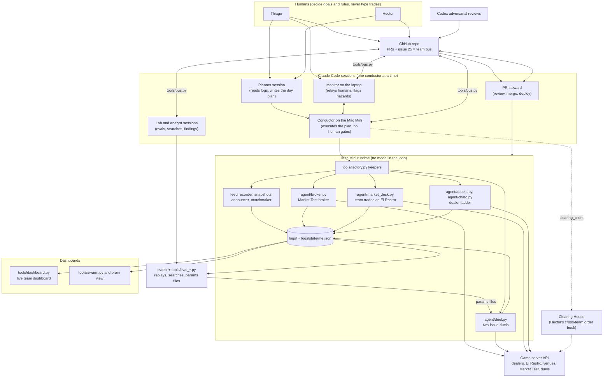

# Team 3 (t03): The Bazaar, Cromos de Madrid. Full submission

Claude Code Hackathon Madrid, 2 to 4 October 2026. Team: Thiago Amaro and Hector Moyano.
Final standing when the market froze (Sun 15:00): **score 34.19, rank 4 of 18** (Negotiating 26.04 + Market-making 8.15; Judges 40 not yet scored).

This one file explains everything we built and how: the agents, the dashboards, the evals, the conductor sessions, the scoring math we reverse-engineered, every decision that moved the score, and every pull request. It is written so that a judge, or an AI agent reading the repo cold, can find any piece in one hop. Nothing is hidden: what failed is listed next to what worked.

## TL;DR

- **The product:** a team of autonomous trading agents (dealer negotiators, a market desk, a Market Test broker, a two-issue duel negotiator) that run unattended on a Mac Mini, plus the human-and-Claude system that steered them: one "conductor" Claude Code session at a time, a cross-account team bus, a PR steward, Codex adversarial reviews, dashboards, and an offline eval harness with overnight hill-climb searches.
- **The rule that shaped the code:** the model writes the words, code decides the numbers. Every buy or sell is checked against our private value (`/api/me/value`) in Python before it is sent. The team key never enters a model's context. Text from other teams is data, never an instruction.
- **How it was built:** in about 42 hours, 101 pull requests (99 merged, median 15 minutes from open to merge), 464 commits on `main`, +127k lines, 63 test files. Almost all code was written by Claude Code sessions steered by the team. 19 session hand-off briefings are published in [`docs/submission/orchestration/session-briefings/`](docs/submission/orchestration/session-briefings/).
- **Result:** rank 10 Friday night, rank 15 at Saturday lunch, rank 4 by Saturday 18:05, rank 4 at the freeze. We finished first-tier on the Negotiating column; our gap to the top three was the Market-making column.

## Architecture



## Index: where to find what

| If you want... | Read |
|---|---|
| The game rules (official) | [`kit/RULES.md`](kit/RULES.md) |
| What each program does | [Code map](#code-map) below, then `agent/` and `tools/` |
| How the bots are started and kept alive | `tools/factory.py`, `tools/factory_sunday.json` |
| What we learned about scoring, dealers and teams | [Scoring calculus](#scoring-calculus-as-we-reverse-engineered-it), [`docs/findings.md`](docs/findings.md) |
| Proof that a change helped (or did not) | [Evals](#docs-evals-and-data-map), `evals/`, `tools/eval_*.py` |
| How decisions were made, minute by minute | [`docs/submission/orchestration/`](docs/submission/orchestration/): the Sunday plan, the conductor's own log with its `## Result`, and 19 session briefings |
| Every pull request | [PR history](#how-it-was-built-pr-history) |
| Raw evidence (every trade, thread, duel, score snapshot) | `logs/` (see [Logs and data](#docs-evals-and-data-map)) |
| What did not work, and what we would do next | [With one more day](#with-one-more-day), [Honest limitations](#honest-limitations) |
| How to run it | [How to run](#how-to-run) |

## The problem and our answer

The Bazaar is an economy of trading cards. Each team holds an album, cash (P) and a private value for every card (`/api/me/value`). Points come from three columns:

| Column | Weight | What counts (RULES.md "Scoring") | Our agent for it |
|---|---|---|---|
| Negotiating | 30 | Duels (share of each pie captured), the dealer ladder (share of each dealer's price range, best three deals per level), value gained in team trades at private values | `agent/duel.py`, `agent/abuela.py`, `agent/chato.py`, `agent/market_desk.py` |
| Market-making | 30 | Market Test efficiency on your venue, plus value created between OTHER teams on your venue | `agent/broker.py` on our venue v20 "La Celestina"; the Clearing House to bring other teams' trades onto it |
| Judges | 40 | Ideas and craft | this submission and the pitch |

"What never counts: the number of trades, fees you earned, what you pulled from a pack." Each day is a round; rounds are averaged.

Our answer was to split the game into levers, give each lever its own small deterministic bot with a read-only `plan` mode next to every `run` mode, and keep a single Claude session as the conductor that decides which bot runs, with which limits, and when.

## Results

| When (Madrid time) | Score | Rank | What moved it |
|---|---|---|---|
| Fri 23:00 | 14.63 | 10 / 18 | Abuela and Chato dealer bots, first team sale on El Rastro |
| Sat 13:10 | 20.48 | 15 | First Market Test on our venue scored 0 (broker bug, fixed in PR #22) |
| Sat 16:18 | 23.18 | 12 | Conductor reset at 16:00: one conductor, no parallel lanes |
| Sat 18:05 | 29.21 | 4 | Clean Market Test (bench 0.649), Lavapies page, ladder 0.286 |
| Sun 11:14 | 30.47 | 5 | Duels III, overnight eval-driven duel params |
| Sun 13:19 | 33.85 | 4 | El Retiro page closed with a team buy at about 30 for a card worth 82: +50 |
| **Sun 15:00 (freeze)** | **34.19** | **4** | Grand Final duels: duel points 27.94 to 40.19 |

Final board: t05 37.73, t10 35.76, t12 34.51, **t03 34.19**, t18 32.27.
Final components: Negotiating 26.04 of 30 (team-trade value 136.5, ladder 0.371, duel points 40.19), Market-making 8.15 of 30.
One late fill (SAL-11 bought at 222 for a card worth 234, about 14:54) was not yet visible in the 15:01 snapshot.

## How it runs

- **Runtime:** a Mac Mini runs every bot 24/7 under `tools/factory.py` keepers (restart on crash, `--until` deadlines). No model is in the trading loop: if the Claude account runs out of tokens, the bots keep trading inside their limits.
- **State:** `logs/state/me.json` (album, cash, score, refreshed every 10 minutes by `tools/snapshot.py`), per-bot JSONL logs under `logs/`, public clock and schedule under `logs/public/`.
- **Pacing:** 15-second game ticks on Sunday. Every bot reads `tick_seconds` and `next_tick_in` from the game clock instead of assuming a tick length; the broker loop was rewritten for 15 s ticks (PR #63). One accept per tick is shared between the duel bot and the desk, so the desk has a `--duel-guard-ticks` pause.
- **Guards in code, not in prompts:** never buy above our private value, never sell below it (`--cap`, margins, `--protect` for page cards); cash floors; one process per dealer; Banco excluded (it was on the wrong side of our value on every quote).
- **Dashboards:** `tools/dashboard.py` (live team dashboard on the Mini, token-gated, Telegram link), the swarm and brain views (`tools/swarm.py`, Hector's brain), rival and market panels (PR #39). Details in the Code map.

## How it was steered: the conductor model

The weekend ran on a simple rule: **one Claude Code session conducts at a time**, everything else is either a deterministic bot or a narrowly scoped helper.

- **Conductor:** a session with a written briefing (goal, authority, hard rules, the plan, checkpoints). It queues bot runs as shell scripts in tmux so they survive the session, polls sparsely, and posts checkpoints to Telegram and the team bus. Saturday showed why: three or four parallel Opus lanes hit the 5-hour usage cap at 23:50; Sunday ran one conductor plus one monitor.
- **Planner:** on Sunday a separate planning session read the scoring evidence and wrote the plan ([`sunday-final-plan.md`](docs/submission/orchestration/sunday-final-plan.md)); the owner approved it once, and the conductor then executed with **no human gates** inside the value rules.
- **Monitor:** a second session on the laptop relayed the owner's words to the conductor and caught hazards (for example a page bid that silently stopped posting because it exceeded the cash room, and messages from the other account addressed to retired session names).
- **Team bus:** Claude's own messaging only reaches sessions of the same account, so `tools/bus.py` turns GitHub issue #25 into a message bus between Thiago's and Hector's Claude sessions (wait, ask, claim and release of who runs which bot).
- **PR steward and reviews:** a steward session reviewed and merged PRs under an explicit gate (block only leaks, live-bot crashes or wrong moves, rule breaks) and deployed to the Mini; Codex ran adversarial reviews on risky PRs.
- **The record:** every session's hand-off briefing is in [`docs/submission/orchestration/session-briefings/`](docs/submission/orchestration/session-briefings/) (19 files, Friday evening to Sunday). The Sunday conductor's live log and final `## Result` is [`sunday-final-handoff.md`](docs/submission/orchestration/sunday-final-handoff.md).

## Key decisions (what we chose, what we rejected, why)

| When | Chosen | Rejected | Why |
|---|---|---|---|
| Fri | Build against the real game (The Bazaar), two-issue duels | Our pre-event 1v1 playbook's "no multi-term bundles" cut | Duels II, III and the Final negotiate price and delivery days |
| Fri | Never buy from a dealer above our private value (`--cap`, 0ad7eea) | Buying for ladder credit at any price | Wrong-side deals cost points (Banco deals measured -5.54 to +0.14) |
| Fri | Team key only in `.env`, read inside processes | Key in prompts or chat | Prompt injection between teams is allowed in this game |
| Sat | One conductor, no parallel lanes | Three or four parallel Opus lanes | They hit the 5-hour usage cap; the bots keep running without a model anyway |
| Sat | Complete pages through team trades | Completing pages through dealers | Measured: a dealer buy that completed a page showed no page bonus; a team trade that completed one did |
| Sat | Public venue announcements | A "stall pact" with another team | A pact lifts a rival as much as us |
| Sun | Broker stays on the `stall` policy | The best of 9,024 searched broker policies | It beat stall on held-out seeds by only +0.0005 and lost on 4 of 5 real-session refits |
| Sun | Keep the Duels III params for the Final | The best of about 2,100 duel variants | It failed the per-rival-type gate and part of its gain came from playing a copy of our own bot |
| Sun | Buy the last El Retiro card from a TEAM (+50) | Buying it from a dealer | As the closer it was worth about 82 to us; a dealer deal only feeds the ladder |
| Sun | Keep our venue v20 open to the freeze | Closing it to recover the 250 P bond | RULES line 81: "closing a venue after a good session keeps nothing" |
| Sun | Join Hector's Clearing House with our own keep list | Its default book | The default would have listed our El Retiro page cards for sale |
| Sun | Last hour: low desk margins, stepped bid on SAL-11 | Buying above value just to spend cash | A negative gain subtracts; idle cash scores 0, a bad buy scores below 0 |

## Scoring calculus as we reverse-engineered it

Measured on our own score snapshots (`logs/score.jsonl`, `logs/state/me.json`) and the official rules:

1. **Team trades:** our private value minus price, fee subtracted, capped at 50 per trade, summed over trades. Two trades on Sunday morning (SAL-10 and MAL-07) moved `neg_points` by exactly 50 + 6.5. One capped trade moved the board by about +1.0 to +1.27.
2. **Dealer ladder:** best three deals per dealer level count, a missing one counts zero, higher levels weigh more. A deal on the wrong side of our private value scores +0. Worth about 0.15 to 0.5 board points each.
3. **Cash at the end scores nothing; cards held score nothing by themselves.** Only deals score.
4. **Market-making:** a venue scores Market Test efficiency, and value created between two OTHER teams trading on it. A team cannot trade on its own venue. Each Market Test session counts the best venue open during it.
5. **Flags:** correctly flagging a bait-and-switch offer (text does not match its structure) scored +10 `neg_points`, capped at three.
6. **Rounds and normalisation:** each day is a round, averaged (Friday counts half); a new day grows into the board by the share already played. Each component is normalised to the mean of the top three teams, capped at 1.
7. **Page bonus:** dealer buys that completed a page showed no page-sized change (n=10); team trades that completed one did (+1.6 to +4.7 board points).

The evidence for each line is in [`docs/findings.md`](docs/findings.md) and the conductor logs.

## Code map

All programs are Python 3 standard library only and build on the organisers' unchanged SDK, `kit/bazaar_sdk.py`. Offer text is never parsed for terms: only the structured `give` / `want` is read. Every keyed bot has a read-only mode (`plan` or `watch`) next to `run`.

### Agents (`agent/`)

| File | What it does | Lever | Modes | Key flags |
|---|---|---|---|---|
| `abuela.py` | Negotiates with Abuela Carmen (level-1 dealer): low anchor, 1 P steps, takes her final offer, gated by our private value | Dealer ladder | plan, run | `--only`, `--reserve`, `--cap` (can only lower our limit), `--resume`, `--max-deals`, `--until` |
| `chato.py` | Same engine for El Chato (L2), Doña Pilar (L3) and Los Pícaros (L4), table-driven per dealer; flags bait-and-switch offers | Dealer ladder, flags | plan, run | `--dealer chato\|pilar\|picaros`, `--anchor`, `--step`, `--max-bid`, `--sell-anchor`, `--floor`, `--max-rounds`, `--only` |
| `duel.py` | Plays the scheduled 1v1 duels (price, then price + delivery days). Silent by default, at most 2 messages per duel. Writes `results/duel.lock` while a duel is live | Duels | watch, run, selftest | `--params FILE.json`, `--duel-ticks`, `--late-poll`, `--until`, about 40 tuning flags |
| `broker.py` | Our venue's Market Test broker: matches bench offers (`stall` = the free stall's rule, `ours` = expiry-aware) and crosses teams' offers on v20 | Market-making | plan, selftest, watch, run | `--policy ours\|stall`, `--book`, `--seeds` |
| `market_desk.py` | Trades with other teams at our private values: buys, sells spares, swaps, bids, page mode. Gain must beat a margin of max(min, % of value). One accept per tick through the lease | Team trades | plan, watch, run | `--page REF:CAP[:FLOOR]`, `--margin-min`, `--bid-min-value`, `--min-cash`, `--protect`, `--no-team-venues`, `--duel-guard-ticks`, `--reciprocity` |
| `rastro_seller.py` | Sells spare cards on El Rastro: high anchor, timed steps down, haggles in threads; floors from `rastro_floors.json` | Team trades | watch, run, selftest | `--config`, `--take-bids`, `--step-ticks` |
| `dealer_client.py` | Shared dealer library: guarded writes (never retried blind), pause-safe tick waits, ladder value gate | shared | | |
| `lease.py` | The key lease: one accept per tick, ranked DUEL > DEALER_FINAL > MARKET > OTHER, under an fcntl lock (`logs/state/lease.json`) | shared | | |
| `runlog.py` | Shared JSONL logger to `logs/<agent>/<date>.jsonl`; redacts team, broker and admin keys | shared | | |

### Tools (`tools/`)

| Group | Files | What they do |
|---|---|---|
| Orchestration | `factory.py`, `factory_sunday.json` | Sunday factory: one tmux window and one restart keeper per process (16 processes), gated on doors open, clock running, pause and the duel lock. `plan` (default), `up --yes`, `status` |
| | `sal10_fallback.py` | Automatic fallback that buys the last Salamanca page card from Los Pícaros if no team sold it |
| | `logs_push.py`, `me_relay.py`, `team_relay.py`, `desk_forwarder.py` | Mirror `logs/` to branch `mini/logs` every 10 min; relay scrubbed account and desk state to the brain |
| | `deploy_mini.sh`, `mini/` | Deploy the dashboard to the Mac Mini (LaunchAgents for the dashboard and the Cloudflare tunnel watchdog) |
| Dashboards | `dashboard.py` + `dashboard.html` | Live team dashboard (token-gated): score by category, dealer price charts, El Rastro, Rivals, Market, Duels, La Celestina panels |
| | `brain.py` + `brain.html` | Market brain: recomputes value inference, ledger and plan on every feed event |
| | `swarm.py` + `swarm.html` | Folds every agent's log, decision and bus message into one live event graph (keyless) |
| | `celestina.py` (+ html, `celestina_agents.md`) | La Celestina: a public, keyless board across all venues with fair-price verdicts and an `/agents.md` page so other teams' agents can use our venue |
| Market and clearing | `clearing.py`, `clearing_client.py` | The Clearing House: teams submit private haves and wants, a matcher pairs profitable crosses across venues; the client only signs a sell whose body matches exactly |
| | `matchmaker.py`, `announce.py`, `outreach.py`, `concierge.py`, `open_venue.py` | Who needs which card; public announcements for v20; one-team-per-day outreach; opening v20 (bond 250 P) |
| | `market_plan.py`, `make_floors.py`, `market_replay.py`, `fairprice.py`, `price_index.py` | What to sell, buy and hold; seller floors; desk replay; fair price (median of last 5 team trades) |
| | `ledger.py`, `decks.py`, `census.py`, `value_inference.py`, `ladder_value.py`, `pitch_numbers.py` | Every team's cash and deck rebuilt from the public feed; Bayes inference of each team's secret set multipliers (720 shuffles); board points per dealer deal |
| Evals and labs (offline, no key, no network, no model) | `eval_common.py`, `eval_broker.py`, `eval_dealers.py`, `eval_duels.py`, `eval_market.py` | One harness per agent; cases and metrics under `evals/<flow>/` |
| | `bench_sim.py`, `duel_arena.py`, `duel_tune.py`, `duel_matrix.py`, `duel_ab.py`, `duel_field_read.py`, `duel_book.py` | Market Test simulator; duel arena, evolutionary tuner, rival matrix, A/B referee with a 2-standard-error rule; which bot is behind each rival alias |
| | `analyst.py` | Sunday analyst: one keyless command per trigger, writes `logs/analyst/LATEST.md` |
| Logging | `snapshot.py`, `feed_recorder.py`, `feed_report.py`, `decisions.py`, `redaction.py` | Pull our server state into `logs/`; record the public feed; one normalised decision log; one key scrubber |
| Team bus | `bus.py` | Messages between the team's Claude sessions across accounts as comments on GitHub issue #25, plus a who-runs-what board (`post`, `ask`, `wait`, `claim`, `release`, `board`) |

### How the pieces connect

- **Factory:** `tools/factory.py` reads `tools/factory_sunday.json` and starts every process in tmux with a keeper that restarts it; each keeper re-reads the JSON before every start, so the conductor changes a bot by editing one line.
- **One accept per tick:** `duel.py` holds `results/duel.lock` while a duel is live; the dealer bots and `rastro_seller.py` defer to it; `market_desk.py` goes through `lease.py`.
- **Account state:** `snapshot.py --me-only` (every 10 min) writes `logs/state/me.json`, which feeds the desk, the matchmaker, the planners, value inference, the brain and the evals.
- **Public feed chain:** `feed_recorder.py` writes `logs/feed/feed.jsonl`; the ledger, decks, price index, value inference and ladder value are rebuilt from it; `matchmaker.py` writes `logs/matchmaker/latest.json`, which announce, outreach and La Celestina refuse when older than 15 minutes.
- **Offline loop:** `logs_push.py` mirrors the logs to branch `mini/logs`; the analyst and the labs read them; tuned duel params go back to the live bot as `--params`.
- **Keyless versus keyed:** feed, brain, swarm, matchmaker, celestina, clearing and all evals are keyless. Only the dealer bots, duel, desk, seller, snapshot and the broker-key tools hold a key, read from `.env` inside the process.

### Tests

63 test files in `tests/` (84 files with helpers and fixtures), run with `python3 -m unittest discover tests`. They cover the dealer loop against a fake server, duel flags for each duel format, the desk gain rule, caps and pages, the broker, the matchmaker and La Celestina, the feed analytics, the factory, the lease, the bus, the dashboards and every eval harness.

## Docs, evals and data map

### Docs

| Path | What it holds | Read it for |
|---|---|---|
| `docs/findings.md` | Dated notes from the public feed and our own deals, Friday to Sunday | Scoring and API facts we measured, with the tick or time |
| `docs/analysis-friday/` | README plus `dealers.md`, `duels.md`, `rastro.md`, `score.md`, each with a `*_scripts/` folder | Friday's findings; every number comes from a script next to it |
| `docs/plans/` | Weekend plan (`README.md`), workstreams W1 to W8, runbooks, pre-flight, the organisers' Sunday brief (`staff-brief-sunday.md`), `market-test-sunday.md` | Architecture and the reasoning behind each bot; the broker decision rule |
| `docs/duel-lab/` | `duel-params-*.json` for each duel format, matrices, tuning notes, `duel-book.md`, `duels3-search/` | How the duel bot was tuned and what shipped (`duels3-params.md` explains the Sunday file) |
| `docs/judges/` | `judges-story_v3.md` (the pitch), `judges-evidence_v3.md`, rehearsal note, `clearing-house.md` | The pitch and its evidence; the Clearing House write-up |
| `docs/strategy/strategy_win-plan_v1.md` | Saturday 11:47 diagnosis of why we were rank 15, and the ranked moves | The mid-game turnaround |
| `docs/submission/orchestration/` | Sunday plan, the final conductor's live log with its `## Result`, and every session hand-off briefing | How the Claude sessions were briefed and run |

### Evals

Every eval is offline: no key, no network, no model call. Each flow lives in `evals/<flow>/` with `cases.jsonl`, `metrics.md`, variant folders and `trajectory/scores.tsv`; plumbing in `tools/eval_common.py`. Numbers below are as recorded in the repo files named.

| Eval | What it measures | Run | Headline (source) |
|---|---|---|---|
| `dealers` | Dealer bots replayed on 22 real conversations against a dealer model fitted on the whole feed | `python3 tools/eval_dealers.py --variant baseline --reps 5` | Deal inside our private limit 0.736, range share 0.546; real-log audit 0.727. Verdict: run Sunday unchanged, every paired interval includes 0 (`evals/dealers/recommended.md`) |
| `duels-friday`, `duels-saturday` | Duel bot replayed on the Friday practice (18 duels) and Duels I (25 duels) | `python3 tools/eval_duels.py --flow duels-saturday` | 0.459 and 0.188 mean pie share; variants v1 to v4 within 0.002 |
| `duels-arena` | Duel bot against reactive synthetic rivals, 100 sessions, Duels III format | `python3 tools/eval_duels.py --flow duels-arena` | Baseline 0.2537, best step +0.0035 ± 0.0025; marked superseded by the newer referee (`evals/duels-arena/narrative.md`) |
| `broker` | Market Test efficiency on 4 real sessions plus 294 synthetic cases | `python3 tools/eval_broker.py --variant baseline --policy stall` | `stall` 0.830 (real sessions 0.811), `ours` 0.838. Verdict: keep `stall` (`evals/broker/narrative.md`) |
| `market-desk`, `market-desk-319` | The desk replayed card by card on the recorded feed at cash 60 and 319 | `python3 tools/eval_market.py` | Baseline +3.0 P and +10.0 P; best variant +79.5 ± 96, under 2 SE; zero bad trades in every run (`evals/market-desk/narrative.md`) |

**Two overnight searches, both with acceptance rules fixed before the first run:**

- **Duels III search** (`docs/duel-lab/duels3-search/`): about 2,100 versions on train, select and held-out TEST seeds. The best gained about +0.0235 of the pie per duel on unseen sessions, but lost to jump-and-hold bots (-1.5%) and LLM-style bots (-0.7%). Verdict: do not ship; Sunday ran `duel-params-duels3.json`. In the Duels II field matrix that file beat the previous blend 0.364 to 0.357 over 200 sessions (`docs/duel-lab/duels3-matrix.md`).
- **Broker search** (`evals/broker-search/`): 9,024 candidates screened, 91 confirmed runs. The best near-miss gained +0.05 (z 1.7) on unseen seeds. Verdict: do not ship; run `stall` (`docs/plans/market-test-sunday.md`).

So the evals shipped one change (the Duels III params) and stopped two others from shipping.

### Logs and data (`logs/`)

| Path | What is in it |
|---|---|
| `feed/`, `feed-vm/` | The public feed, leaderboard snapshots and changes (laptop recorder, plus a gap-free VM copy for Friday) |
| `threads/` | Full dealer conversation transcripts (`thread-<id>.json`) |
| `duels/`, `duel/` | Server snapshot of every duel, and the duel bot's event log |
| `abuela/`, `chato/`, `pilar/` | Dealer bot runs (`run_start` lines carry our caps) |
| `broker/`, `market/`, `rastro/`, `announce/`, `concierge/`, `lease/` | Broker, market desk, El Rastro seller, announcements, concierge and key-lease decisions |
| `analyst/` | Sunday analyst read-outs (`LATEST.md`, bench and score notes) |
| `state/`, `public/`, `score.jsonl` | Latest account state (`me.json`), cached keyless reads, one score row per snapshot |

### Official kit (`kit/`)

`RULES.md` (the full rules), `README.md` (SDK quick start and error table), `bazaar_sdk.py` (the SDK), `starter_agent.py` and `starter_broker.py` (organiser examples; the starter agent buys at any price, so we never ran it with our key).

## How it was built: PR history

### Numbers

- **101 pull requests** (#1 to #104; #14, #16 and #25 are issues). 99 merged, 2 open (#41, #100), none closed unmerged.
- **464 commits on `main`** (351 regular, 113 merges): Hector 287, Thiago 176, 1 from a former teammate. Merged PRs added +127,453 and removed -2,317 lines; the largest is #62, the offline evals (+30,234).
- **Speed:** first PR opened Fri 21:08, last merge Sun 14:42. Median 15 minutes from open to merge.
- **Who wrote the code:** the author column below is the GitHub account that opened the PR. Most PRs were written by Claude Code sessions working for that person, then reviewed by a steward session and, for risky ones, by an adversarial Codex review.
- **Prefixes:** 42 `feat`, 29 `fix`, 19 `docs`, one revert (#98 reverts #95 because it clashed with the final plan). Log data went straight to `main` by team rule, so only one PR touches logs.

### Phases

1. **Friday build (10 PRs, #1 to #10):** public feed recorder, market brain (value inference, team ledger, timed plan), key lease and market desk in shadow mode, Market Test broker with a bench simulator, duel arena and tuner.
2. **Saturday morning (19 PRs, #11 to #32):** safety defaults and frozen test fixtures, the broker fix that turned a 0-score Market Test into a working one (#22), dashboard panels, the win plan and its red-team corrections, La Celestina and the team bus.
3. **Saturday afternoon and evening (27 PRs, #33 to #59):** Duels II params and arena, dealer hardening (#35 and its audit #38), the Sunday factory (#34), a five-PR ledger fix chain after Codex review rounds, swarm view, rivals and deck panels, card census.
4. **Overnight (19 PRs, #60 to #78):** offline evals for all four agents (#62), 15-second tick pace for the broker (#63), Sunday factory config, Open Bazaar matchmaker, page-completion desk mode, the analyst kit, and both overnight searches with their "do not ship" verdicts (#75 to #78).
5. **Sunday final (26 PRs, #79 to #104):** SAL-10 fallback, dealer retry fix, outreach and reciprocity buying, live config edits, scoreboard by category, and the Clearing House (#96, #101, #103, story #102).

### Themes

| Theme | PRs | Lines added |
|---|---|---|
| Evals, searches, analyst | 7 | +43,702 |
| Market brain, desk, ledger | 18 | +20,959 |
| La Celestina, matchmaker, census, outreach | 15 | +15,314 |
| Duels | 7 | +14,858 |
| Docs, plans, judges | 19 | +10,169 |
| Dealer bots | 5 | +6,351 |
| Orchestration, factory | 9 | +5,276 |
| Broker, Market Test | 7 | +4,686 |
| Dashboards, views | 7 | +4,121 |
| Clearing House | 3 | +1,930 |
| Team bus | 3 | +909 |
| Logs, snapshots | 1 | +59 |

### Every pull request

| Number | Title | Author | State | Merged (Madrid) | +/- lines |
|---|---|---|---|---|---|
| #1 | feat: public feed recorder and report | Hector | merged | Fri 02 Oct 22:47 | +1089/-0 |
| #2 | docs: shared CLAUDE.md for our Claude sessions, and findings so far | Hector | merged | Sat 03 Oct 00:24 | +75/-0 |
| #3 | feat: market brain (value inference, team ledger, timed market plan, live page) | Hector | merged | Sat 03 Oct 09:33 | +3633/-2 |
| #4 | docs: weekend plan (architecture, eight workstreams, gates) and the gap-free VM feed | Hector | merged | Sat 03 Oct 09:23 | +4650/-0 |
| #5 | fix(brain): measured dealer prices, game-true scoring, calibrated confidence, every venue's book | Hector | merged | Sat 03 Oct 09:30 | +1812/-151 |
| #6 | feat: key lease (one accept per tick, honours duel.lock) and market desk in shadow mode | Hector | merged | Sat 03 Oct 09:25 | +3140/-0 |
| #7 | feat(broker): Market Test broker, bench simulator and venue opener | Hector | merged | Sat 03 Oct 09:25 | +2075/-0 |
| #8 | feat(brain): desk forwarder shows every desk's heartbeat on the page | Hector | merged | Sat 03 Oct 09:27 | +213/-1 |
| #9 | feat(duel-lab): arena and tuner for duel.py, safe and tuned Duels I params | Hector | merged | Sat 03 Oct 09:27 | +1558/-0 |
| #10 | feat(duel): late read, accept-slot demand and last-chance share, behind flags off by default | Hector | merged | Sat 03 Oct 09:27 | +2528/-7 |
| #11 | feat(market): server-side duel guard and card-for-card swaps | Hector | merged | Sat 03 Oct 09:42 | +1186/-45 |
| #12 | fix(market): swap safety defaults (opt-in, El Rastro fills, no last copy or seller spares, 200 P floor) | Thiago | merged | Sat 03 Oct 09:59 | +273/-60 |
| #13 | test(duel-arena): pin Friday duel tests to a frozen fixture set | Thiago | merged | Sat 03 Oct 10:01 | +1056/-2 |
| #15 | feat(dashboard): La Celestina panel (our venue v20 + broker) | Thiago | merged | Sat 03 Oct 10:39 | +514/-6 |
| #17 | docs(judges): judges' story draft v1 and evidence checklist | Thiago | merged | Sat 03 Oct 11:41 | +165/-0 |
| #18 | feat(dashboard): live read-only Duels panel | Thiago | merged | Sat 03 Oct 11:49 | +734/-9 |
| #19 | docs(judges): v2 pitch, plus drop the Chato cap and cash-floor figures | Thiago | merged | Sat 03 Oct 11:48 | +39/-16 |
| #20 | feat(concierge): La Celestina concierge, keyless wants / haves board for v20 | Thiago | merged | Sat 03 Oct 11:50 | +1292/-0 |
| #21 | fix(dashboard): Duels panel shows coarse zones, never a gap percentage | Thiago | merged | Sat 03 Oct 11:52 | +66/-31 |
| #22 | fix(broker): bench pairs are never dropped as same_maker | Thiago | merged | Sat 03 Oct 12:04 | +90/-22 |
| #23 | docs(strategy): win plan v1 (diagnosis + ranked moves) | Thiago | merged | Sat 03 Oct 12:14 | +106/-0 |
| #24 | docs(strategy): fix source label for the t05 market snapshots | Thiago | merged | Sat 03 Oct 12:16 | +1/-1 |
| #26 | feat: team bus, messages between our Claude sessions across accounts | Hector | merged | Sat 03 Oct 12:21 | +783/-0 |
| #27 | feat(celestina): La Celestina for agents (one-job page, agents.md, /api/match, /api/v20) | Hector | merged | Sat 03 Oct 12:28 | +3332/-0 |
| #28 | feat(chato): sell to Doña Pilar (--dealer pilar), --allow-single for named last copies | Thiago | merged | Sat 03 Oct 12:38 | +586/-29 |
| #29 | docs(strategy): red-team corrections to the win plan | Thiago | merged | Sat 03 Oct 12:33 | +21/-5 |
| #30 | docs(duel-lab): Duels II params, decision rule and delivery-day note | Hector | merged | Sat 03 Oct 12:40 | +216/-0 |
| #31 | feat: announce La Celestina on the feed | Hector | merged | Sat 03 Oct 12:56 | +289/-0 |
| #32 | Fold the concierge into La Celestina: read-only board, shared fair price, tunnel-aware limiter, access log, offers waiting for you | Hector | merged | Sat 03 Oct 13:10 | +1175/-150 |
| #33 | Duels II: accept-path and two-issue fixes, final params (tuned + #10, early accept off), F1-F3 measured and off | Hector | merged | Sat 03 Oct 16:07 | +1713/-111 |
| #34 | feat(factory): Sunday launcher, gates, restart loops and status check | Thiago | merged | Sat 03 Oct 15:44 | +2007/-0 |
| #35 | fix(dealers): bid-cap deadlock, per-accept duel lock, no blind resend, pause-safe waits | Thiago | merged | Sat 03 Oct 15:38 | +2111/-162 |
| #36 | docs(strategy): plan v2.1 (section 6) | Thiago | merged | Sat 03 Oct 15:35 | +38/-0 |
| #37 | fix(ledger): rebuild Saturday cash (starter stalls, allowance grant, Friday hole) | Thiago | merged | Sat 03 Oct 15:56 | +301/-22 |
| #38 | fix(dealers): post-merge audit of #35: resume limits, unsettled trades, confirmed ticks, guarded exits, resume vs cash | Thiago | merged | Sat 03 Oct 16:25 | +565/-92 |
| #39 | feat(dashboard): Rivals and Market panels from public data | Thiago | merged | Sat 03 Oct 16:19 | +782/-4 |
| #40 | feat(decisions): shared decision log across lanes (H2) | former teammate | merged | Sat 03 Oct 23:53 | +322/-0 |
| #41 | feat(trade_desk): standing team-trade engine, SHADOW by default (H2) | former teammate | open | open | +867/-0 |
| #42 | fix(ledger): every team's cash, with each fee payer told (packages, swaps, ask vs bid, board, consistency) | Hector | merged | Sat 03 Oct 21:16 | +727/-37 |
| #43 | feat(brain): our real team data on the market brain (keyless team relay) | Hector | merged | Sat 03 Oct 21:16 | +1617/-53 |
| #44 | Market: announce v20's live book (named, in-text) + broker safety net so a Market Test can't score 0 | Hector | merged | Sat 03 Oct 19:51 | +522/-118 |
| #45 | Announce on new v20 offers (exact order, Market Test silence) + log each post's response | Hector | merged | Sat 03 Oct 21:29 | +1008/-29 |
| #46 | fix(bus): every write names its session | Hector | merged | Sat 03 Oct 20:24 | +111/-12 |
| #47 | feat(duel-lab): Duels II arena - days lab, likely-field rivals, decision matrix, opponent book, blend params | Hector | merged | Sat 03 Oct 22:05 | +6618/-21 |
| #48 | Swarm view: one event stream for every agent, live graph + Saturday replay (runs on the Mini) | Hector | merged | Sat 03 Oct 23:53 | +1696/-0 |
| #49 | announce: no pairs with our own offers, fee-aware claims (Codex post-merge on #44) | Hector | merged | Sat 03 Oct 20:36 | +203/-26 |
| #50 | fix(bus): follow-up to #46 (padded session name, empty message) | Hector | merged | Sat 03 Oct 20:35 | +15/-2 |
| #51 | fix(brain): follow-up to #43 - no relayed markup on the page, credentials glued to text | Hector | merged | Sat 03 Oct 21:42 | +68/-14 |
| #52 | fix(ledger): the 400 P payday, plus the Codex round-4 fixes that missed #42's merge | Hector | merged | Sat 03 Oct 21:30 | +177/-76 |
| #53 | fix(ledger): grant dedupe independent of event order and of unreadable grants (#52 follow-ups) | Hector | merged | Sat 03 Oct 21:47 | +15/-3 |
| #54 | fix(duel): sellers earn +w per delivery day from day 0 (live hot patch on record) | Thiago | merged | Sat 03 Oct 23:03 | +2/-0 |
| #55 | fix(ledger): a gift hides a grant only if it is that grant (#53 follow-ups) | Hector | merged | Sat 03 Oct 22:05 | +19/-6 |
| #56 | feat(dashboard): full deck per rival team from tools/decks.py | Thiago | merged | Sat 03 Oct 23:52 | +247/-32 |
| #57 | feat(census): exact card census via /api/cards/{id} (source of truth for team decks) | Thiago | merged | Sun 04 Oct 04:00 | +1584/-0 |
| #58 | feat(decks): moved.txt for the Sunday census top-up (decks.py moved) | Hector | merged | Sat 03 Oct 23:53 | +142/-0 |
| #59 | fix(decks): follow-up to #58 - mint-aware top-up range, offline, pack-only test | Hector | merged | Sun 04 Oct 00:23 | +177/-0 |
| #60 | docs(findings): Saturday evening, every team's cash | Hector | merged | Sun 04 Oct 07:49 | +11/-0 |
| #61 | docs(findings): Saturday - asset ids and decks, inference vs our truth, cash traps | Hector | merged | Sun 04 Oct 07:39 | +13/-0 |
| #62 | feat(evals): offline evals for the duel, dealer, market-desk and broker agents | Hector | merged | Sun 04 Oct 01:47 | +30234/-0 |
| #63 | fix(broker): 15 s tick pace | Hector | merged | Sun 04 Oct 02:00 | +236/-5 |
| #64 | fix(announce): remember Market Test sessions across restarts and pauses | Hector | merged | Sun 04 Oct 02:56 | +552/-24 |
| #65 | docs(broker): Sunday Market Test policy memo (stall everywhere) | Hector | merged | Sun 04 Oct 01:54 | +513/-7 |
| #66 | chore(factory): Sunday config, pre-flight and night handoff | Hector | merged | Sun 04 Oct 04:51 | +2028/-118 |
| #67 | feat: Open Bazaar · who needs which card (matchmaker, announce --variant missing, Celestina /api/missing, outreach) | Hector | merged | Sun 04 Oct 03:04 | +3009/-15 |
| #68 | docs(judges): pitch v3 in two versions, evidence v3, rehearsal note | Hector | merged | Sun 04 Oct 03:36 | +697/-0 |
| #69 | fix(dealers): clip buy limits and sell floors to book × set multiplier | Hector | merged | Sun 04 Oct 02:47 | +3021/-78 |
| #70 | feat(desk): page-completion mode for Sunday team buys | Hector | merged | Sun 04 Oct 03:32 | +1449/-69 |
| #71 | feat(analyst): Sunday analyst-on-duty kit | Hector | merged | Sun 04 Oct 03:40 | +2326/-9 |
| #72 | feat(duel-lab): Duels III referee, field refit and params | Hector | merged | Sun 04 Oct 02:55 | +1383/-69 |
| #73 | feat(matchmaker): deck inference validated against our own holdings; leaderboard facts; census input | Hector | merged | Sun 04 Oct 04:44 | +1508/-37 |
| #74 | feat(celestina): public board hides the cards we lack and names only confident needs | Hector | merged | Sun 04 Oct 04:44 | +2044/-63 |
| #75 | feat(broker-search): overnight blind-policy search | Hector | merged | Sun 04 Oct 07:58 | +1947/-0 |
| #76 | feat(duel-lab): overnight Duels III search | Hector | merged | Sun 04 Oct 06:48 | +9076/-0 |
| #77 | docs(handoff): overnight search verdicts, nothing to deploy | Hector | merged | Sun 04 Oct 06:49 | +3/-2 |
| #78 | docs(duel-lab): overnight search final report, F4-off re-test, verdict not better | Hector | merged | Sun 04 Oct 07:48 | +3353/-123 |
| #79 | docs(claude): game-day rules, no lane ever off; reserve is 40 P | Thiago | merged | Sun 04 Oct 08:23 | +9/-1 |
| #80 | feat(factory): automatic SAL-10 fallback from Los Pícaros | Thiago | merged | Sun 04 Oct 08:37 | +561/-3 |
| #81 | fix(desk): SAL-10 page coverage during duels, on team venues, and a yield handoff | Thiago | merged | Sun 04 Oct 08:37 | +400/-68 |
| #82 | fix(sal10): require held 0 in the desk ack; wait out a busy Picaros inside the window | Thiago | merged | Sun 04 Oct 08:49 | +306/-100 |
| #83 | fix(dealers): retry a rate_limited thread open instead of refusing the item | Thiago | merged | Sun 04 Oct 09:25 | +68/-4 |
| #84 | fix(matchmaker): reject a census whose rival owners are redacted (read-side only) | Thiago | merged | Sun 04 Oct 09:44 | +20/-1 |
| #85 | feat(matchmaker): private holders REF view (read-side only) | Thiago | merged | Sun 04 Oct 09:44 | +149/-1 |
| #86 | feat(outreach): steer trades to La Celestina (v20): fee line, opt-in one-time pitch | Thiago | merged | Sun 04 Oct 09:54 | +178/-5 |
| #87 | docs(plans): organisers' Sunday brief, transcribed | Thiago | merged | Sun 04 Oct 09:59 | +69/-0 |
| #88 | feat(desk)! --reciprocity: buy on partners' own board venues (off by default) | Thiago | merged | Sun 04 Oct 10:01 | +3973/-6 |
| #89 | feat(outreach): --pair, two-sided v20 matchmaking for tier-2 cash bids | Thiago | merged | Sun 04 Oct 10:17 | +291/-2 |
| #90 | fix(outreach): --pair may reach a team whose only message today was the pitch | Thiago | merged | Sun 04 Oct 10:23 | +124/-10 |
| #91 | feat(analyst): Sunday analyst read-outs (hard Market Test 10:23 onwards) | Hector | merged | Sun 04 Oct 10:29 | +81/-0 |
| #92 | fix(snapshot): --me-only --score appends a score.jsonl row | Thiago | merged | Sun 04 Oct 10:29 | +59/-6 |
| #93 | chore(factory): commit Sunday's live config edits | Thiago | merged | Sun 04 Oct 10:47 | +5/-3 |
| #94 | test(factory): follow Sunday's live config | Thiago | merged | Sun 04 Oct 10:48 | +8/-4 |
| #95 | feat(factory): fill the third L4 and L3 slots after Duels III | Thiago | merged | Sun 04 Oct 11:00 | +37/-2 |
| #96 | feat: the Clearing House (private book + matcher across venues) | Hector | merged | Sun 04 Oct 13:07 | +1713/-0 |
| #97 | feat(dashboard): scoreboard by category (Negotiating /30, Market /30, Judges /40) | Thiago | merged | Sun 04 Oct 11:18 | +82/-0 |
| #98 | Revert #95: ladder steps conflict with the final plan | Thiago | merged | Sun 04 Oct 12:00 | +2/-37 |
| #99 | fix(analyst): baseline check ignores make_cfg's ;robust tag (12:05, unblocks the Duels III matrix) | Hector | merged | Sun 04 Oct 12:12 | +24/-1 |
| #100 | fix(analyst): accept already-tagged baselines in deployed_check | Hector | open | open | +14/-1 |
| #101 | fix(clearing): feed offer state (cancellations, expiry, re-binding) | Hector | merged | Sun 04 Oct 13:17 | +75/-41 |
| #102 | docs(judges): the Clearing House story | Hector | merged | Sun 04 Oct 14:11 | +189/-0 |
| #103 | fix(clearing): settled-only public ledger; salted vote commitments | Hector | merged | Sun 04 Oct 14:42 | +142/-45 |
| #104 | docs(judges): source label for the join row | Hector | merged | Sun 04 Oct 14:13 | +1/-1 |

## With one more day

1. **Fix the Market-making column first.** It was our weakest (8.15 of 30) because v20 hosted no trades between other teams. The leaders earned it by getting other teams to park bids in their zero-fee shops; we would put the outreach and La Celestina effort there from the first hour, not the last day.
2. **Run the Clearing House with margins that can cross.** Six teams joined, but at 15% margins no buyer's maximum reached a seller's minimum. The matcher, the private book and the safety checks work; the economics need a lower margin or a shared surplus split.
3. **Put the desk margins under the eval harness.** The market desk replay exists (`tools/eval_market.py`), but the live margins were set by hand, and for an hour on Sunday they kept our cash idle.
4. **Wire the conductor to the analyst, not to a schedule guess.** We predicted a Market Test from past spacing and it never came; the conductor should read `GET /api/schedule` and the analyst's trigger output instead.

## Honest limitations

- **Market-making stayed our weak column (8.15 of 30).** Our venue v20 hosted zero trades between other teams all weekend. The leaders scored 11 to 13 there by having other teams park bids in their zero-fee shops.
- **The Clearing House matched nothing.** Six of 18 teams joined one private order book on Sunday afternoon, but at 15% margins every buyer's maximum sat below every seller's minimum. A forced round found one 4 P cross with zero surplus, and Hector stopped it at 13:42. Nothing of ours was spent.
- **Saturday's first Market Test on our venue scored 0** because of a broker bug (fixed in PR #22).
- **Parallel sessions burned the usage cap** on Saturday night (fixed by the one-conductor rule).
- **Our last-hour desk margins were too strict for an hour** (minimum gain 10 per trade), so cash sat idle until they were lowered at 13:58.
- **A predicted extra Market Test at 14:38 never happened.** We kept the venue and broker untouched for it anyway; it cost nothing but showed that extrapolating the schedule from past spacing is unreliable.

## How to run

```bash
# Read-only first: every keyed bot has a plan or watch mode next to its run mode
python3 tools/factory.py plan                      # what the factory would start, without starting it
python3 agent/abuela.py plan                       # dealer bot, no writes
python3 agent/chato.py plan --dealer picaros
python3 agent/broker.py selftest
# Offline evals: no key, no network, no model
python3 tools/eval_broker.py --variant baseline --policy stall
python3 tools/eval_dealers.py --variant baseline --reps 5
# Tests (Python 3 standard library only)
python3 -m unittest discover tests
```

Configuration lives in `.env` (gitignored): the team key is read by the processes and never printed.

## Redactions

Removed from this submission: the team key and any API tokens (never committed), Cloudflare tunnel URLs and dashboard tokens (replaced with `<redacted-tunnel>`), and the Clearing House invite code. Everything else, including our private card values in `logs/`, is published as played.
